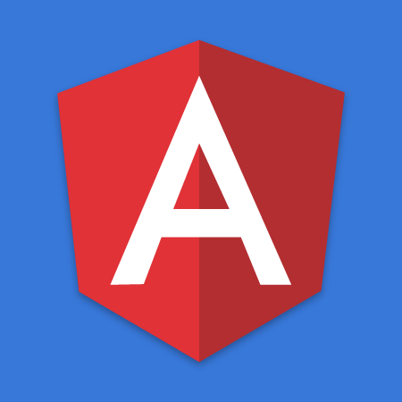

# App Template for Angular 11 Best Practices with DNN and 2sxc

## What is this?

If you wish to develop Angular within DNN, the initial setup can be challenging. This template App solves a bunch of problems for you, like:

1. develop on your local system with hot-reloading as you work
1. use DNN and 2sxc WebAPIs out-of-the box with all the right headers
1. multiple code editions, so you can test staging code on the production server, without interrupting users who see the live edition

## How to Install

The solution in as **2sxc App** and can be installed from 2sxc (inside DNN). Follow [these instructions](https://azing.org/2sxc/r/oCmPBI3p).

## Links

* App Tutorial Angular 11 [Github](https://github.com/2sic/app-template-angular) | [app catalog](https://2sxc.org/en/apps/app/tutorial-and-template-app-for-angular-11)
* Dnn-Sxc-Angular [npm](https://www.npmjs.com/package/@2sic.com/dnn-sxc-angular)
* Documentation [recipes & instructions on azing](https://azing.org/2sxc/l/VPE4Usua/angular-apps-development)

## History

* 2020-11-09 updated shared code which extracts the generated index.html for DNN
* 2021-02-25 
    * Improved razor code split
    * using latest (v11) dnn-sxc-angular
    * split examples into sub-module to make it easy to remove them
    * extensive documentation of everything inside this
    * edit-toolbars in the application
    * after edit a callback refreshes the data (instead of page reload)
    * made data multi-language (English and German)